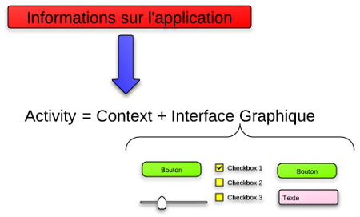
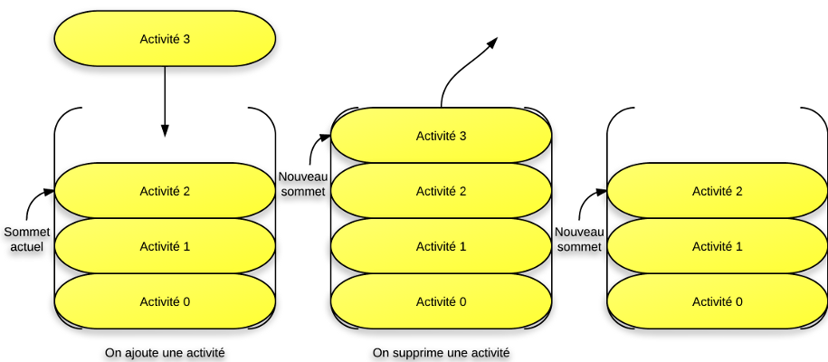
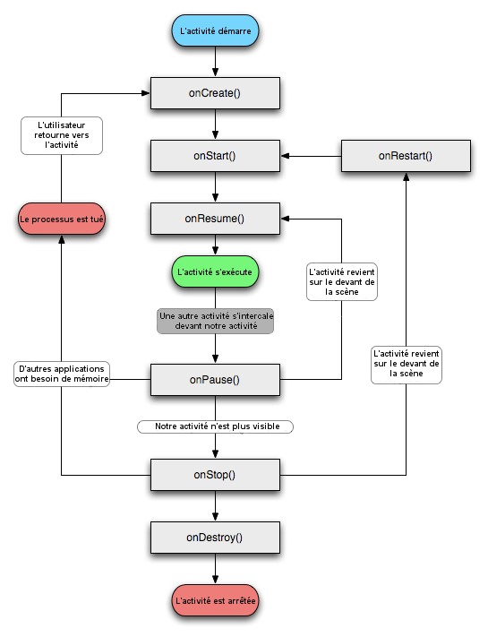

# **Chapitre 1 : Premier Application**  **第一章：第一个应用程序**

## 应用程序 / Application  

应用程序是可以导航的窗口程序集。  
Une application est un assemblage de fenêtres entre lesquelles il est possible de naviguer.  

## 活动 / Activité  

这些不同的窗口称为活动。  
Ces différentes fenêtres sont appelées des activités.  

### 如何区分活动？ / Comment différencier les activités ?  

- **通过比较图形界面 / En comparant leur interface graphique** :  
  - 如果界面完全不同，则它们是不同的活动。  
    Si elles sont radicalement différentes, c'est qu'il s'agit d'activités différentes.  
- **活动占满整个屏幕 / Une activité remplit tout l'écran**  
  - 应用程序一次只能显示一个活动。  
    Votre application ne peut en afficher qu'une à la fois.  

### 活动的作用 / Rôle de l’Activité  

- 活动是应用程序的一个基本组件，它提供了支持图形界面的结构。  
  Une activité sert de support sur lequel vient se greffer une interface graphique.  
- 然而，活动并不负责创建和布局图形元素；它只是一个脚手架，在上面可以插入图形对象。  
  Cependant, ce n'est pas le rôle de l’activité de créer et de disposer les éléments graphiques ; elle n'est qu'un échafaudage sur lequel vont s'insérer les objets graphiques.  

## 图形界面 / Interface Graphique  

图形界面是一组可视化元素，用户可以通过它与应用程序交互，或者获取信息。  
Une interface graphique est un ensemble d’éléments visuels avec lesquels les utilisateurs peuvent interagir ou qui leur fournissent des informations.  

## Context（上下文）  

活动还包含关于应用程序当前状态的信息，这些信息称为 Context。  
Une activité contient des informations sur l’état actuel de l’application : ces informations s’appellent le **context**.  

### Context 的作用 / Rôle du Context  

- Context 充当了 Android 系统与应用程序不同部分之间的桥梁。  
  Ce context constitue un lien entre le système Android et les différentes activités de l’application.  
- Context 代表的是应用程序当前的运行环境，包括：  
  Le context représente l’environnement d’exécution actuel de l’application, comprenant :  
  - **访问系统资源 / Accès aux ressources système**（如 Wi-Fi、音频服务、文件系统等）。  
  - **允许组件交互 / Interaction entre les composants**（如 Activity、Service、BroadcastReceiver 之间的通信）。  
  - **管理应用程序生命周期 / Gestion du cycle de vie de l’application**。  



## **示例 / Exemple**  

### **情况 / Situation**  

假设你正在用手机浏览 **Zero** 网站，同时在同一部手机上播放音乐。  
Imaginez que vous naviguiez sur le **Site du Zéro** avec votre téléphone, tout en écoutant de la musique sur ce même téléphone.  

在你的系统中会发生两件事：  
Il se passe alors deux choses dans votre système :  

1. **互联网浏览 / Navigation sur Internet**  
   - 通过图形界面（至少是地址栏和网页内容）进行浏览。  
   - Permis par une interface graphique (la barre d'adresse et le contenu de la page web, au moins).  

2. **音乐播放 / Lecture de Musique**  
   - 音乐在后台播放，但目前不显示图形界面，因为用户正在查阅浏览器。  
   - La musique est diffusée en fond sonore, mais elle n'affiche pas d'interface graphique à l'heure actuelle puisque l'utilisateur consulte le navigateur.  

---

### **结论 / Conclusion**  

- 这意味着至少有两个应用程序在同时运行。  
  On a ainsi au moins deux applications lancées en même temps.  
- **然而，浏览器显示一个活动，而音频播放器没有显示活动。**  
  Cependant, le navigateur affiche une **activité**, alors que le lecteur audio **n'en affiche pas**.  
- **这说明 Context 是可以同时运行的，但不同的应用程序有不同的活动。**  
  Cela signifie que plusieurs contextes peuvent fonctionner simultanément, mais que chaque application a ses propres activités.  

  

## États d'une activité / 活动报告

### Gestion des activités sous Android  

#### Principe général / 基本原则  

Si un utilisateur reçoit un appel, il devient plus important qu'il puisse y répondre que d'émettre la chanson que votre application diffuse.  
**如果用户接到电话，对他们来说，接听电话比播放应用程序正在播放的歌曲更重要。**  

Pour pouvoir toujours répondre à ce besoin, les développeurs d'Android ont eu recours à un système particulier :  
**为了满足这一需求，Android 开发人员发明了一种特殊的系统：**  

- À tout moment, votre application peut laisser place à une autre application ayant une priorité plus élevée.  
  **在任何时候，你的应用程序都可能让位于另一个优先级更高的应用程序。**  
- Si votre application utilise trop de ressources système, alors elle empêchera le système de fonctionner correctement et Android l'arrêtera sans vergogne.  
  **如果你的应用程序占用了太多系统资源，就会妨碍系统正常工作，Android 就会无情地关闭它。**  

Votre activité existera dans plusieurs états au cours de sa vie, par exemple un état actif pendant lequel l'utilisateur l'exploite, et un état de pause quand l'utilisateur reçoit un appel.  
**您的活动在其生命周期内会有几种状态，例如用户操作时的活动状态，以及用户接到呼叫时的暂停状态。**  

#### La pile d'activités / 活动栈  

- Lorsque votre application est lancée, elle est placée en haut de la pile d'activités.  
  **当应用程序启动时，它会被放置在活动栈的最顶端。**  
- L'activité que voit l'utilisateur est celle qui se trouve au sommet de la pile.  
  **用户看到的活动是堆栈顶部的活动。**  
- Lorsqu'un appel arrive, il se place au sommet de la pile et remplace l'affichage de votre application, qui passe en deuxième position.  
  **当有电话进来时，它就会进入堆栈顶层并显示出来，而你的应用程序则会被推到第二位。**  
- Votre activité ne reviendra que lorsque toutes les activités au-dessus d'elle seront arrêtées et supprimées de la pile.  
  **只有当上面的所有活动都停止并从堆栈中移除后，你的活动才会返回。**  
- On retrouve ainsi le principe vu précédemment : un seul écran visible à la fois.  
  **这就重复了前面解释过的原则：终端上同一时间只能显示一个应用程序，而且显示的是堆栈顶部活动的图形界面。**  

### Les trois états d'une activité / 活动的三种状态  

| **État 预算**      | **Visibilité 可见性** | **Description 说明** |
|-------------------|---------------------|---------------------|
| **Active (« active » ou « running ») 活跃** | L'activité est visible en totalité. **所有活动都清晰可见。** | Elle est sur le dessus de la pile, c'est que l'utilisateur consulte en ce moment même et il peut l'utiliser dans son intégralité. **它处于堆栈的顶部，是用户当前正在查看的内容，用户可以完整地使用它。** |
| **Suspendue (« paused ») 暂停** | L'activité est partiellement visible à l'écran. **活动在屏幕上部分可见。** | L'utilisateur n'agit plus dessus, l'application n'a plus le focus. **用户不再执行此活动，应用程序不再拥有焦点。** |
| **Arrêtée (« stopped ») 停止** | L'activité est complètement masquée par une autre activité. **这项活动被另一项活动覆盖，所以你根本看不到它。** | L'application n'a plus le focus, l'utilisateur ne peut plus interagir avec elle. **应用程序不再拥有焦点，由于用户看不到它，因此也无法对其进行操作。** |

---

- **Une seule activité visible à la fois** : l'application qui est au sommet de la pile est celle qui est affichée.  
  **同一时间只能显示一个活动：位于栈顶的应用程序才是当前可见的。**  

## Cycle de vie d'une activité / 活动生命周期

### Introduction / 介绍  

Une activité n'a pas de contrôle direct sur son propre état (et par conséquent vous non plus en tant que programmeur), il s'agit plutôt d'un cycle rythmé par les interactions avec le système et d'autres applications.  
**活动无法直接控制自己的状态（因此，作为程序员的您也无法控制它），相反，它是一个与系统和其他应用程序交互的循环。**  

Voici un schéma qui présente ce que l'on appelle le cycle de vie d'une activité, c'est-à-dire qu'il indique les étapes que va traverser notre activité pendant sa vie, de sa naissance à sa mort.  
**下面的图表显示了活动的生命周期，即活动从创建到销毁的各个阶段。**  



Chaque étape du cycle est représentée par une méthode. 
**周期的每个阶段都由一个方法表示。**  

---

### Héritage et structure / 继承与结构  

Les activités héritent de la classe `Activity`. Or, la classe `Activity` hérite de l'interface `Context` dont le but est de représenter tous les composants d'une application.  
**活动继承自 `Activity` 类，而 `Activity` 类又继承自 `Context` 接口，`Context` 旨在表示应用程序的所有组件。**  

Ces composants se trouvent dans le package `android.app.Activity`.  
**这些组件位于 `android.app.Activity` 包中。**  

#### 📌 **Rappel sur les packages / 关于包的提醒**  

Un package est un répertoire qui permet d'organiser notre code source, un récipient dans lequel nous allons mettre nos classes de façon à pouvoir trier notre code et différencier des classes qui auraient le même nom.  
**包是一个组织源代码的目录，它充当一个容器，使我们能够分类代码并区分具有相同名称的类。**  

##### **Exemple / 例子**

Supposons que vous ayez deux classes `X`, mais avec des usages différents. Sans organisation, il serait impossible de les différencier lorsque vous instanciez un objet `X`. Java générerait une erreur indiquant qu'il ne sait pas à quelle classe `X` vous faites référence.  
**假设你有两个 `X` 类，但用途不同。如果没有组织，它们将无法区分，并且 Java 会报错，无法判断你指的是哪个 `X` 类。**  

C'est comme essayer de stocker deux fichiers ayant le même nom dans un même répertoire : cela créerait une incohérence.  
**这就像在同一目录下存放两个同名文件一样，这是不可能的。**  

##### **Solution : la hiérarchie des packages / 解决方案：包的层次结构**

Pour éviter cette confusion, on utilise une hiérarchie de packages :  
**为了避免这种问题，我们使用包的层次结构：**  

- On peut stocker les deux classes `X` dans des packages différents `Y` et `Z`.  
  **可以将两个 `X` 类存放在不同的包 `Y` 和 `Z` 中。**  
- Ainsi, on pourra les différencier en les appelant respectivement `Y.X` et `Z.X`.  
  **这样，我们可以分别通过 `Y.X` 和 `Z.X` 来引用它们。**  

Dans le cas d'un navigateur web, on pourrait avoir des packages comme :  
**例如，网络浏览器的代码可能会有以下包结构：**  

- `Web.Affichage.Image`  
- `Web.Affichage.Video`  
- `Web.Telechargement`  

---

### Les vues et l'interface graphique / 视图与图形界面  

Les **vues** (ou *views* en anglais) sont les composants graphiques qui viennent se greffer sur notre échafaudage d'activité.  
**视图（Views）是附加到活动结构上的图形组件。**  

#### **📌 Définition des vues / 视图的定义**

- Une vue est l'unité de base de l'interface graphique.  
  **视图是图形界面的基本单元。**  
- Son rôle est de fournir du contenu visuel avec lequel il est possible d'interagir.  
  **视图的作用是提供可视化内容，以便用户交互。**  
- Comme en Java, les vues peuvent être disposées à l'aide de **conteneurs**.  
  **就像在 Java 中一样，视图可以使用容器来排列。**  

Nous verrons plus tard comment organiser ces vues efficacement.  
**稍后我们将学习如何高效地组织视图。**  

---

### Conclusion / 结论  

- **L'activité suit un cycle de vie** dicté par le système Android.  
  **活动的生命周期受 Android 系统管理。**  
- **Les activités héritent de la classe `Activity`, qui elle-même hérite de `Context`**.  
  **活动继承自 `Activity` 类，而 `Activity` 又继承自 `Context` 接口。**  
- **Les packages aident à organiser le code et éviter les conflits de classes**.  
  **包的作用是组织代码，并避免类名冲突。**  
- **Les vues constituent les éléments graphiques d'une activité** et peuvent être disposées à l'aide de conteneurs.  
  **视图是活动的图形界面元素，并且可以使用容器进行排列。**  

```java
package com.siteduzero.mapremiereapplication;

import android.os.Bundle;
//utilisé pour stocker des données lors du changement d’état de l’activité.
//用于在活动改变状态时存储数据。
import android.app.Activity; 
//représente une activité Android.Activity ：表示 Android 活动。
import android.widget.TextView;
//composant pour afficher du texte à l’écran ：用于在屏幕上显示文本的组件。

/* 
 * Classe MainActivity : représente l’activité principale de l’application.
 * Elle hérite de la classe Activity et crée un TextView pour afficher du texte à l’écran.
 * */
public class MainActivity extends Activity {
    private TextView texte = null;
    /*  
    * Méthode onCreate : crée l’activité et crée la vue TextView.
    * Elle est appelée lorsque l’activité est créée.
    * @param savedInstanceState : contient les données de l’activité sauvegardées du type Bundle.
    * Si l'activité est lancée pour la première fois, savedInstanceState vaut null.如果活动是首次启动， savedInstanceState 就是 null 。
    * Si l'activité redémarre après une interruption, savedInstanceState contient les données enregistrées précédemment.如果活动在中断后重新开始， savedInstanceState 包含先前保存的数据。
    * */
    @Override
    protected void onCreate(Bundle savedInstanceState) {
        //crée l’activité ：创建活动。
        super.onCreate(savedInstanceState);

        //crée la vue TextView ：创建 TextView 视图。
        texte = new TextView(this);
        //Méthode setText : modifie le texte affiché par la vue TextView.
        //setText 方法用于设置或修改 TextView 显示的文本。
        texte.setText("Bonjour, vous me devez 1 000 000€.");

        //ajoute la vue TextView à l’activité ：将 TextView 视图添加到活动中。
        setContentView(texte);
    }
}
```

---
