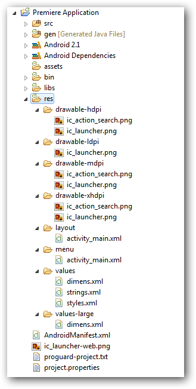

# **Chapitre 2 : Les ressources et le format XML**
**第二章：资源与 XML 格式**

## **1. Introduction aux ressources / 资源简介**

Le répertoire **`res/`** contient toutes les ressources nécessaires à l’application pour s’adapter à différents écrans.  
**`res/` 目录包含应用程序用于适应不同屏幕的所有资源。**  

### 📌 **Pourquoi organiser les ressources ? / 为什么要组织资源？**

- **Éviter la perte de qualité** en proposant plusieurs tailles d’images.  
  **提供多种尺寸的图片，以避免放大后质量下降。**  
- **Faciliter l’adaptation à différentes résolutions et langues.**  
  **确保在不同设备上正确显示内容，并适应不同的语言。**  
- **Android sélectionne automatiquement la bonne ressource** selon le terminal.  
  **Android 会根据设备自动选择适当的资源。**  

---

## **2. Le format XML / XML 格式**

### **📌 XML, un langage de balisage / XML，一种标记语言**

XML est un **langage de balisage** similaire au HTML.  
**XML 是一种类似 HTML 的标记语言，HTML 间接衍生自 XML。**  

📌 **Différences avec un langage de programmation (Java, C++)** :  

| **Langage de programmation** | **Langage de balisage** (XML) |
|-----------------------------|------------------------------|
| Effectue des calculs et affiche des résultats. | Organise et structure des données. |
| Utilisé pour la logique métier. | Utilisé pour stocker des informations de manière structurée. |

Un fichier XML est **interprété** par un programme, tout comme un navigateur web interprète du HTML.  
**XML 文件需要由程序解析，就像浏览器解析 HTML 一样。**

---

## **3. Exemple pratique : Contacts en XML / XML 实例：存储联系人**

Imaginons que nous souhaitons stocker nos contacts en XML.  

```xml
<?xml version="1.0" encoding="utf-8"?>
<contacts>
    <contact>
        <nom>Anaïs</nom>
        <telephone>1111111111</telephone>
    </contact>
    <contact>
        <nom>Romain</nom>
        <telephone>2222222222</telephone>
    </contact>
</contacts>
```

- **&lt;?xml version="1.0" encoding="utf-8"?&gt;** : déclaration XML, On utilise la version 1.0 de XML et l’encodage UTF-8.
- **&lt;contacts&gt;** : la balise, Elle commence par un chevron ouvrant < et se termine par un chevron fermant >.
**il va falloir la fermer** : 
- Soit par la balise fermante **&lt;/contacts&gt;** : vous pourrez avoir du contenu entre la balise ouvrante et la balise fermante.
- Soit on ferme la balise directement dans son corps : **&lt;contact&gt note="20"/&gt;** : on peut ajouter des attributs à la balise, note="20" est une attribut dans cet exemple. équivalent à : **&lt;contact note="20"&gt;&lt;/contact&gt;** qui n'pas d'attribut, mais un contenu.


```xml
<?xml version="1.0" encoding="utf-8"?>
<bibliotheque>
  <livre style="fantaisie">
    <auteur>George R. R. MARTIN</auteur>
    <titre>A Game Of Thrones</titre>
    <langue>klingon</langue>
    <prix>10.17</prix>
  </livre>
  <livre style="aventure">
    <auteur>Alain Damasio</auteur>
    <titre>La Horde Du Contrevent</titre>
    <prix devise="euro">9.40</prix>
    <recommandation note="20"/>
  </livre>
</bibliotheque>
```

- **&lt;livre style="fantaisie"&gt;** : balise, elle a un attribut style="fantaisie".

Dans un fichier XML, une hiérarchie peut être créée en plaçant des nœuds à l’intérieur d’autres nœuds.在 XML 文件中，可以通过将节点置于其他节点内来创建层次结构。
Un nœud parent encapsule d’autres nœuds.父节点封装其他节点。
Les nœuds enfants sont contenus dans un nœud parent.子节点包含在父节点中。

## **5. Types de ressources dans Android / Android 资源类型**

| **Dossier / 目录** | **Description / 说明** | **Contenu / 内容** | **Analyse syntaxique / 语法分析** |
|-------------|------------------|-------------|------------------|
| `res/drawable/` | Images et dessins XML / 设计和图像 | `.png`, `.jpg`, `.xml` | **Oui** / 是 |
| `res/layout/` | Interfaces utilisateur XML / 页面布局或图形界面 | `.xml` (Disposition des vues) | **Exclusivement** |
| `res/menu/` | Menus de l'application / 菜单 | `.xml` | **Exclusivement** |
| `res/values/` | Variables et chaînes de caractères / 不同的变量 | `strings.xml`, `colors.xml` | **Exclusivement** |
| `res/raw/` | Fichiers de données brutes / 原始数据 | `.mp3`, `.html` | **Le moins possible** |

**Exclusivement** : Si la ressource ne contient que des fichiers XML.完全：如果资源只包含 XML 文件。
**Oui** : Si elle peut contenir d'autres types de fichiers en fonction des besoins (ex. drawable/ peut contenir des images ou XML).是：如果可以根据需要包含其他文件类型（例如 drawable/ 可以包含图像或 XML）。
**Le moins possible** : Si XML n'est pas recommandé, car d'autres répertoires sont mieux adaptés (ex. raw/ est pour les fichiers qui ne trouvent pas leur place ailleurs).尽可能少：不建议使用 XML，因为其他目录更合适（例如， raw/ 用于存放不适合放在其他地方的文件）。



- **Les ressources sont organisées dans des répertoires spécifiques pour faciliter l’adaptation aux différents écrans et langues.**  
- **资源被组织在特定的目录中，使其更容易适应不同的屏幕和语言。**

---

## **6. Organisation avancée des ressources**

📌 **Android permet de gérer différentes ressources selon :**  
📌 **Android 允许根据以下条件管理不同的资源：**

1. **La résolution d’écran** (`drawable-ldpi` 120dpi, `drawable-mdpi` 160dpi, `drawable-hdpi` 240dpi,  `drawable-xhdpi` 320dpi, `drawable-xxhdpi` 480dpi, `drawable-nodpi` - pour ne pas redimensionner les images matricielles).  
   **屏幕分辨率**
2. **L’orientation de l’écran** (`layout-land` pour paysage 横向, `layout-port` pour portrait 纵向).  
   **屏幕方向**
3. **La langue et la région** (`values-fr`, `values-en`, `values-zh-rCN`).  
   **语言和地区**（ `values-fr` 为法语，`values-en` 为英语，`values-zh-rCN` 为简体中文）。
4. **Taille de l'écran** (`drawable-small`, `drawable-normal`, `drawable-large` tabllettes, `drawable-xlarge` téléviseurs).  
   **屏幕大小**（小型、正常、大型、超大型）。
5. **Version d'Android** (`drawable-v21`, `drawable-v23`, `layout-v17`, `values-v21`).  

**Exemple :**

- res/layout-fr 针对所有使用法语系统的用户设计特定的布局。
- res/values-fr-rFR-port 仅显示给选择了法语（法国）且手机为纵向的用户。


## **7. Référence des ressources dans le code / 代码中引用资源**

Il ne faut pas préciser le type de ressource dans le code, Android sélectionne automatiquement la bonne ressource selon le terminal.  
在 Java 代码中不需要明确指定资源的类型，Android 会自动根据设备的特性选择最合适的资源。

### **R.java / R 类**

La classe R (Resource) est générée automatiquement par Android Studio et contient toutes les ressources de l'application.  
R 类是 自动生成的，用于存储应用程序资源（如布局、字符串、图片等）的 唯一标识符。

- 该类位于 gen/ 目录下，R.java 文件会在编译时自动生成，不要手动修改。
- R 类是 public final 的，这意味着它不能被继承或实例化。

```java
public final class R {
  public static final class attr {
  }
  public static final class dimen {
    public static final int padding_large=0x7f040002;
    public static final int padding_medium=0x7f040001;
    public static final int padding_small=0x7f040000;
  }
  public static final class drawable {
    public static final int ic_action_search=0x7f020000;
    public static final int ic_launcher=0x7f020001;
  }
  public static final class id {
    public static final int menu_settings=0x7f080000;
  }
  public static final class layout {
    public static final int activity_main=0x7f030000;
  }
  public static final class menu {
    public static final int activity_main=0x7f070000;
  }
  //res/values/strings.xml 中定义的字符串
  public static final class string { 
    public static final int app_name=0x7f050000;
    public static final int hello_world=0x7f050001;
    public static final int menu_settings=0x7f050002;
    public static final int title_activity_main=0x7f050003;
  }
  public static final class style {
    public static final int AppTheme=0x7f060000;
  }
}
```

### **R.values**

#### R.string

res/values/strings.xml :

```xml
<resources>
    <string name="app_name">My Application</string>
    <string name="hello_world">Hello World!</string>
</resources>
```

修改访问资源：

```java
import android.app.Activity;
import android.os.Bundle;
import android.widget.TextView;

public class Main extends Activity {
  private TextView text;
  private String hello;

  @Override
  public void onCreate(Bundle savedInstanceState) {
    super.onCreate(savedInstanceState);

    // 获取字符串资源
    hello = getResources().getString(R.string.hello_world); // 获取 hello_world 字符串的资源 ID
    // 修改字符串
    hello = hello.replace("World", "Android");

    text = new TextView(this);
    text.setText(hello);
    setContentView(text);
  }
}
```

- `getResources()` : 用于获取当前应用程序的资源。
- `getString(R.string.hello_world)` : 用于获取字符串资源。

#### R.values

`res/values/strings.xml`：存放字符串。
`res/values/colors.xml`：存放颜色值。
`res/values/dimens.xml`：存放尺寸信息。

```xml
<resources>
    <color name="primary_color">#FF0000</color>
</resources>
```

```java
int color = getResources().getColor(R.color.primary_color);
```

### **R.drawable / R.layout / R.menu / R.values**

#### R.drawable

`res/drawable/ic_launcher.png`
`res/drawable/background.xml`

```java
imageView.setImageResource(R.drawable.ic_launcher);
```

##### R.layout

`res/layout/activity_main.xml`

```java
setContentView(R.layout.activity_main);
```

##### R.menu

`res/menu/main_menu.xml`

```java
@Override
public boolean onCreateOptionsMenu(Menu menu) {
    getMenuInflater().inflate(R.menu.main_menu, menu);
    return true;
}
```

---
